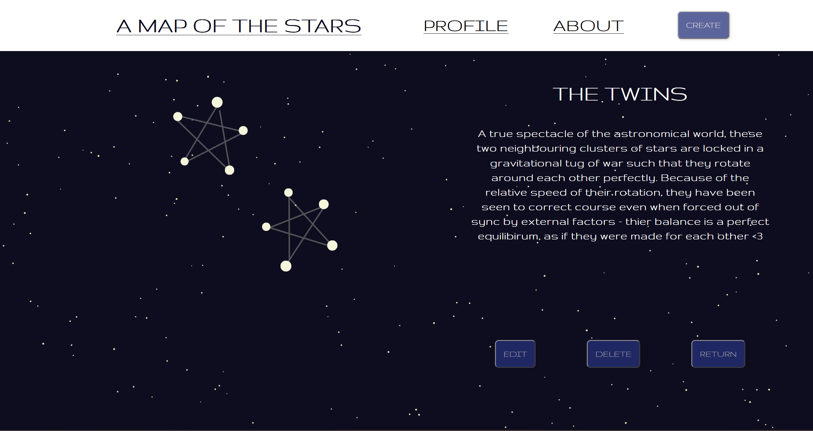

# StarMap

### Description

StarMap is a constellation creation web app that empowers users to design custom constellations with personalized messages. The intuitive process involves drawing stars and lines between them, allowing users to craft unique celestial patterns, as well as allowing users to add a name, description, and position to their constellations, in order to create a truly personalized and unique night sky.

## Table of Contents:

- [Installation/Setup](#installationsetup)
- [Features](#features)
- [Technologies Used](#technologies-used)
- [License](#license)

## Installation/Setup

To set up the StarMap project locally, follow these steps
- clone the repo via `git clone https://github.com/Freddynnn/StarMap.git`
- install dependencies via `npm install` 
- start the frontend via  `cd StarMap/frontend && npm run start`

This will start the frontend of the StarMap project, and you can access it by opening your browser and navigating to http://localhost:3000.

Note: The backend is already deployed, so you don't need to run it locally for the basic functionality of the frontend. If you want to run the backend locally or make changes, follow the same steps in the backend folder with the command `npm run devStart` when in the backend folder.

## Features

StarMap boasts the following key features:

**Virtual Night Sky:** Design and explore your own virtual night sky by configuring the number of shimmering stars that litter the background, the speeds and frequencies at which shooting stars stream by, and even the layout of how your own personal constellations fill out the cosmos!

**Custom Constellations:** Create intricate custom constellations via this interactive and imaginative approach to crafting your own cosmic patterns for your night sky.

    

 

plot each star and their respective connecting lines via the interactive drawing board, and fill their log's information in to truly personalize the constellations.

    
    

 

<!--  -->

**Intuitive Interface:** Enjoy a user-friendly interfaces that make the constellation creation, integration and navigation processes smooth and seamless. This includes constellation hovering & highlighting: 

## Technologies Used

List of technologies, frameworks, and libraries used in this project:

#### Frontend

- **React.js**: A JavaScript library for building user interfaces.
- **Redux**: A state management library for managing the state of the application.
- **React Router**: A library for handling navigation in a React application.

#### Backend

- **Node.js**: A JavaScript runtime built on Chrome's V8 JavaScript engine.
- **Express.js**: A minimal and flexible Node.js web application framework.
- **MongoDB**: A NoSQL database for storing application data.
- **Mongoose**: An ODM (Object Document Mapper) for MongoDB and Node.js.
- **MongoDB Atlas**: Cloud database service for hosting MongoDB databases.

#### Deployment

- **Vercel**: A platform for deploying frontend applications.
- **Render**: A cloud platform for deploying and hosting backend applications.

#### Development Tools

- **VSCode**: Visual Studio Code, a source-code editor.
- **Git**: A distributed version control system.
- **GitHub**: A web-based hosting service for version control using Git.
- **npm**: Main package manager for JavaScript.

#### Styling

- **CSS**: Cascading Style Sheets for styling the application.

#### Other

- **Axios**: A promise-based HTTP client for making requests to a server.

##License
Specify the license under which your project is distributed.

